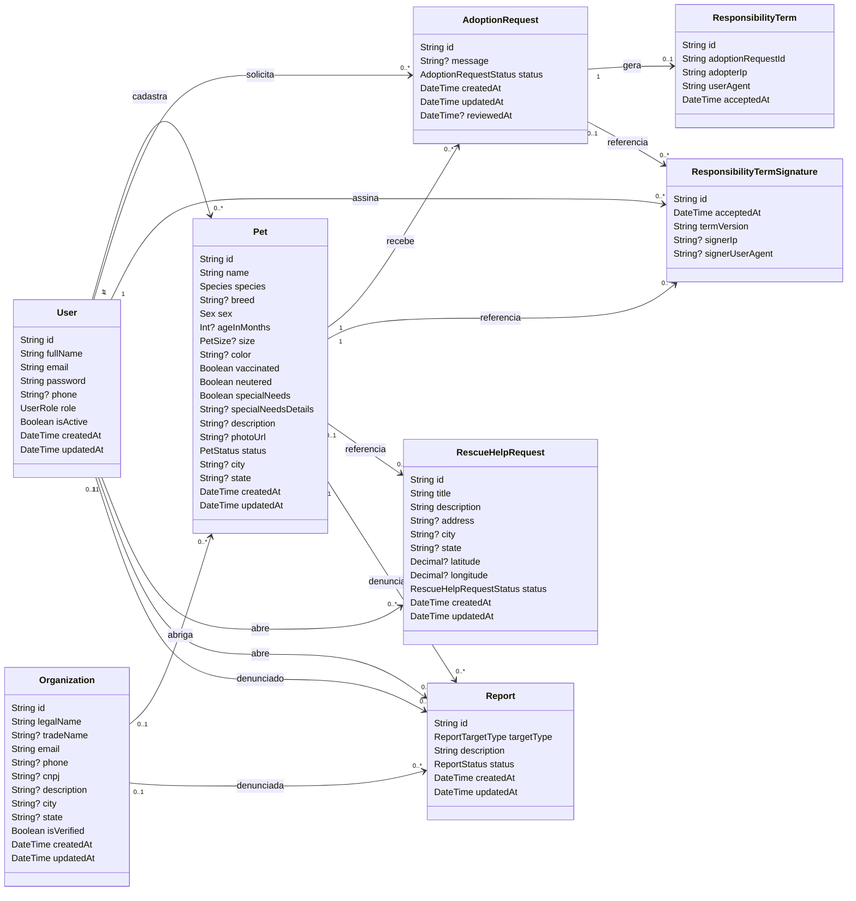

# Diagrama de Classes

```mermaid
classDiagram
  direction LR

  class User {
    String id
    String fullName
    String email
    String password
    String? phone
    UserRole role
    Boolean isActive
    DateTime createdAt
    DateTime updatedAt
  }

  class Organization {
    String id
    String legalName
    String? tradeName
    String email
    String? phone
    String? cnpj
    String? description
    String? city
    String? state
    Boolean isVerified
    DateTime createdAt
    DateTime updatedAt
  }

  class Pet {
    String id
    String name
    Species species
    String? breed
    Sex sex
    Int? ageInMonths
    PetSize? size
    String? color
    Boolean vaccinated
    Boolean neutered
    Boolean specialNeeds
    String? specialNeedsDetails
    String? description
    String? photoUrl
    PetStatus status
    String? city
    String? state
    DateTime createdAt
    DateTime updatedAt
  }

  class AdoptionRequest {
    String id
    String? message
    AdoptionRequestStatus status
    DateTime createdAt
    DateTime updatedAt
    DateTime? reviewedAt
  }

  class ResponsibilityTerm {
    String id
    String adoptionRequestId
    String adopterIp
    String userAgent
    DateTime acceptedAt
  }

  class ResponsibilityTermSignature {
    String id
    DateTime acceptedAt
    String termVersion
    String? signerIp
    String? signerUserAgent
  }

  class RescueHelpRequest {
    String id
    String title
    String description
    String? address
    String? city
    String? state
    Decimal? latitude
    Decimal? longitude
    RescueHelpRequestStatus status
    DateTime createdAt
    DateTime updatedAt
  }

  class Report {
    String id
    ReportTargetType targetType
    String description
    ReportStatus status
    DateTime createdAt
    DateTime updatedAt
  }

  User "1" --> "0..*" Pet : cadastra
  Organization "0..1" --> "0..*" Pet : abriga
  User "1" --> "0..*" AdoptionRequest : solicita
  Pet "1" --> "0..*" AdoptionRequest : recebe
  AdoptionRequest "1" --> "0..1" ResponsibilityTerm : gera
  User "1" --> "0..*" ResponsibilityTermSignature : assina
  Pet "1" --> "0..*" ResponsibilityTermSignature : referencia
  AdoptionRequest "0..1" --> "0..*" ResponsibilityTermSignature : referencia
  User "1" --> "0..*" RescueHelpRequest : abre
  Pet "0..1" --> "0..*" RescueHelpRequest : referencia
  User "1" --> "0..*" Report : abre
  User "0..1" --> "0..*" Report : denunciado
  Pet "0..1" --> "0..*" Report : denunciado
  Organization "0..1" --> "0..*" Report : denunciada
```
