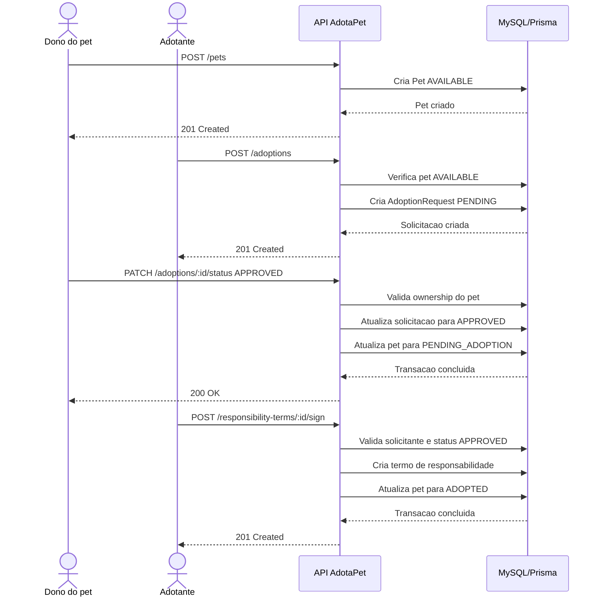

# Fluxo de Adocao

Este documento descreve o fluxo principal de adocao implementado no backend AdotaPet.

## Visao Geral

O fluxo de adocao conecta tres partes principais:

- usuario que cadastrou o pet;
- usuario interessado em adotar;
- pet disponivel para adocao.

O processo passa por solicitacao, analise, aprovacao e assinatura do termo de responsabilidade.

## Estados Principais

### PetStatus

| Status | Significado |
| --- | --- |
| `AVAILABLE` | Pet disponivel para receber solicitacoes |
| `PENDING_ADOPTION` | Solicitacao aprovada, aguardando conclusao da adocao |
| `ADOPTED` | Pet adotado apos assinatura do termo |
| `IN_TREATMENT` | Pet em tratamento |

### AdoptionRequestStatus

| Status | Significado |
| --- | --- |
| `PENDING` | Solicitacao criada e aguardando analise |
| `APPROVED` | Solicitacao aprovada pelo responsavel pelo pet |
| `REJECTED` | Solicitacao rejeitada |
| `CANCELED` | Solicitacao cancelada |

## Fluxo Principal

1. Um usuario autenticado cadastra um pet.
2. O pet e criado com status `AVAILABLE`, caso nenhum status diferente seja informado.
3. Outro usuario autenticado solicita a adocao do pet.
4. O backend cria uma `AdoptionRequest` com status `PENDING`.
5. O usuario responsavel pelo pet consulta as solicitacoes recebidas.
6. O responsavel aprova a solicitacao.
7. A solicitacao muda para `APPROVED`.
8. O pet muda para `PENDING_ADOPTION`.
9. O adotante assina o termo de responsabilidade.
10. O backend cria um `ResponsibilityTerm` com IP e User-Agent.
11. O pet muda para `ADOPTED`.

## Diagrama de Sequencia

## Regras De Negocio

- So pets com status `AVAILABLE` podem receber solicitacao de adocao.
- A solicitacao nasce com status `PENDING`.
- Apenas o usuario que cadastrou o pet pode aprovar, rejeitar ou cancelar a solicitacao.
- Ao aprovar uma solicitacao, o pet passa para `PENDING_ADOPTION`.
- Apenas o solicitante da adocao pode assinar o termo.
- A solicitacao precisa estar `APPROVED` para permitir assinatura.
- Apos assinatura do termo, o pet passa para `ADOPTED`.
- Uma solicitacao nao pode ter mais de um `ResponsibilityTerm`.

## Testes Relacionados

| Tipo | Arquivo |
| --- | --- |
| Unitario | `src/modules/adoptions/adoptions.service.spec.ts` |
| Unitario | `src/modules/responsibility-terms/responsibility-terms.service.spec.ts` |
| Integracao | `test/integration/core-services.integration-spec.ts` |
| E2E | `test/critical-flows.e2e-spec.ts` |
